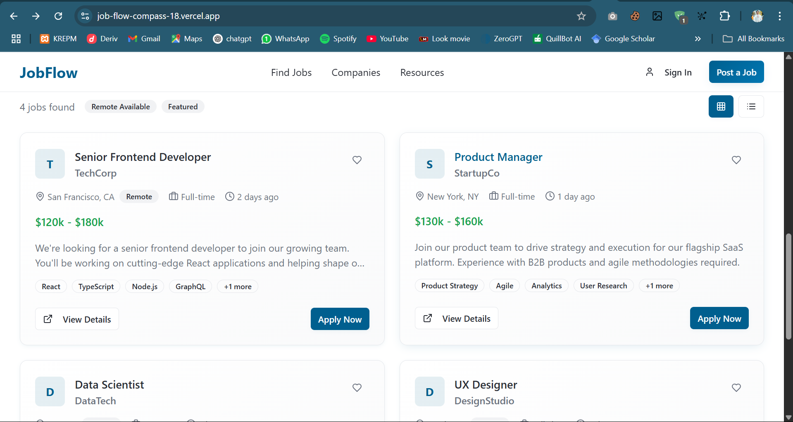
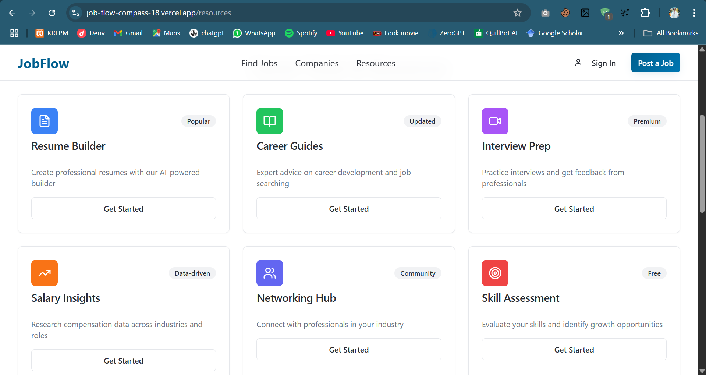
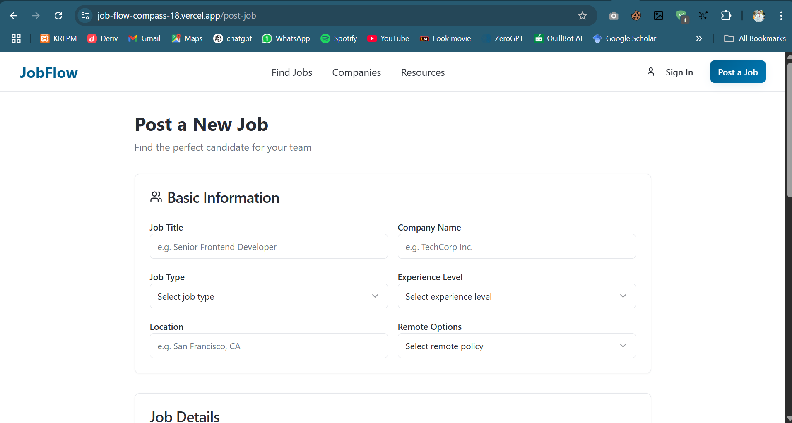
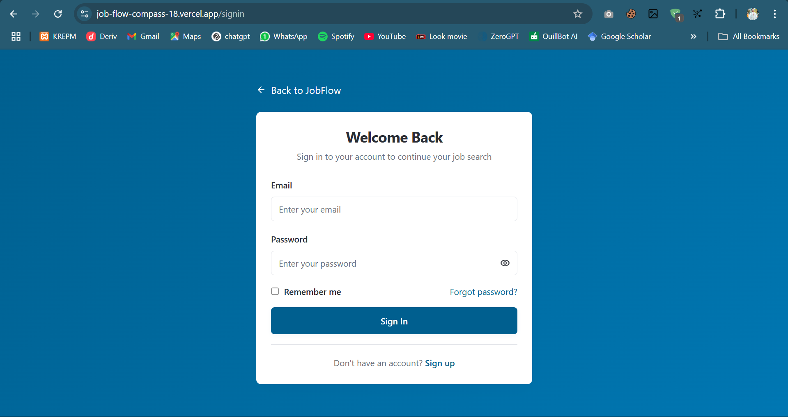

# JobFlow

## Project Description
JobFlow is a modern job board platform designed to connect job seekers with top companies and startups worldwide. It offers a sleek and user-friendly interface for browsing job opportunities, managing applications, and posting new job listings. The platform supports role-based access, ensuring that only authorized users can post jobs. Key features include job search with filters, user authentication, profile management, and a responsive design for seamless experience across devices.

## Setup Instructions

### Prerequisites
- Node.js (v16 or higher)
- npm or yarn
- MongoDB (local or cloud instance)

### Backend Setup
1. Navigate to the backend directory:
   ```bash
   cd backend
   ```
2. Install dependencies:
   ```bash
   npm install
   ```
3. Configure environment variables (create `.env` file) with your MongoDB URI and other settings.
4. Seed the database with initial companies and jobs:
   ```bash
   npx ts-node seedJobs.ts
   ```
5. Start the backend server:
   ```bash
   npm run dev
   ```

### Frontend Setup
1. Navigate to the frontend directory (root):
   ```bash
   cd ..
   ```
2. Install dependencies:
   ```bash
   npm install
   ```
3. Start the frontend development server:
   ```bash
   npm run dev
   ```
4. Open your browser and visit `http://localhost:8080` to access the application.

## Deployed Application
[JobFlow Live Demo](https://job-flow-compass-18.vercel.app/)  
*(Replace with actual deployment URL)*

## Video Demonstration
Watch a 5-10 minute video demonstration of JobFlow:  
[JobFlow Pitch Deck & Demo](https://www.canva.com/design/DAGuLYcTuzc/Ev7OPxaCm6_RlDXaFt0qyw/edit?utm_content=DAGuLYcTuzc&utm_campaign=designshare&utm_medium=link2&utm_source=sharebutton)

## Screenshots of Key Features

### Home Page


### Jobs Listing


### Resources Page


### Post Job


### Post Job

---

For any questions or issues, please contact the project maintainer.
